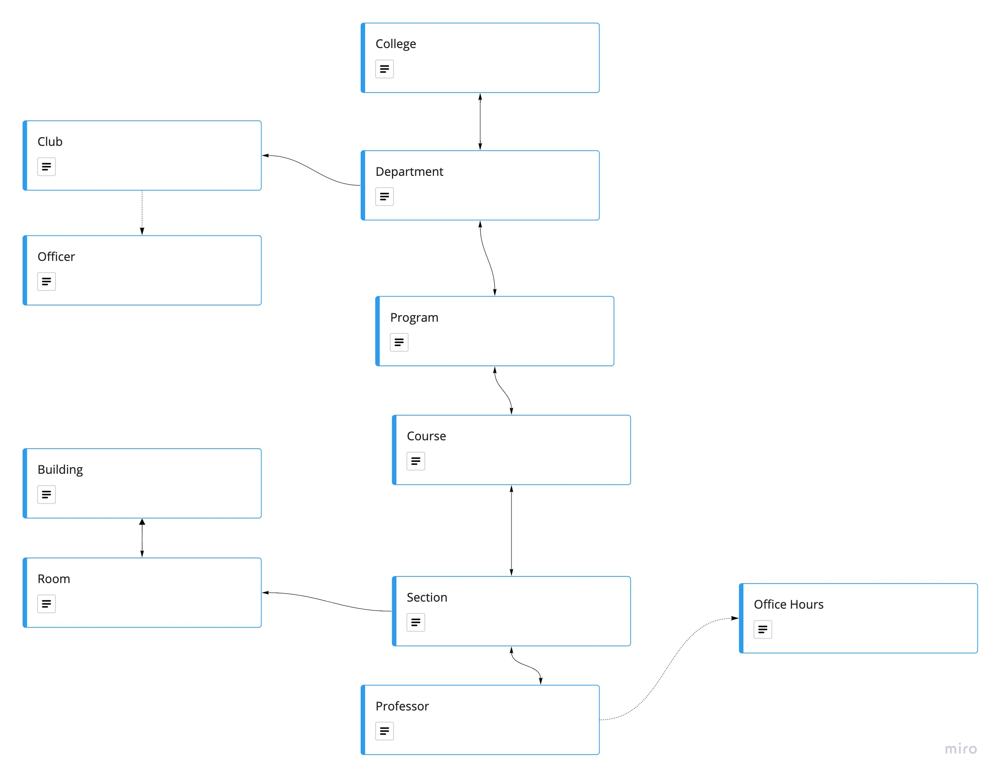

# Cal Poly Knowledge Graph

A GraphQL API for exploring information about Cal Poly.

## Getting Started

Clone the repository

```bash
git clone https://github.com/calpoly-csai/cal-poly-knowledge-graph.git
```

Set up the development environment

```bash
conda env create --file environment.yml
pre-commit install
```

Launch the development server

```bash
python app.py
```

Visit [`http://127.0.0.1:5000/graphql`](http://127.0.0.1:5000/graphql) in your browser to interact with the API. For more information about the GraphiQL UI, check out the [docs](https://github.com/graphql/graphiql/tree/main/packages/graphiql#readme)

## Web Scrapers

The knowledge graph stays up to date by periodically running web scrapers that grab updated information from external sources. You can run these web scrapers by calling `python scraper_data.py`. To write your own web scraper, add a new Python file to the `scrapers` directory. The [`CollegeScraper`](./scrapers/college_scraper.py) works as a good example template to get started.

## Resources

- [GraphQL + Flask Tutorial](https://graphene-mongo.readthedocs.io/en/latest/tutorial.html)
- [Intro to GraphQL](https://graphql.org/learn/)
- [Learn GraphQL](https://www.howtographql.com)
- [AutoScraper](https://github.com/alirezamika/autoscraper)


